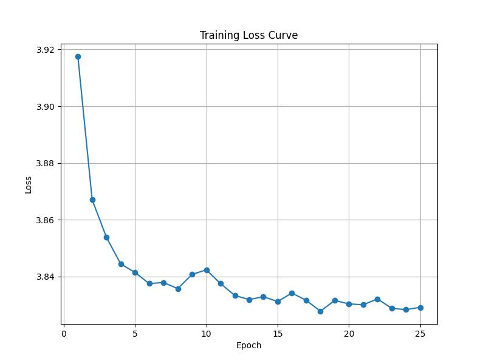

# Model Stealing in Self-Supervised Learning (TML Assignment 2)

This project investigates **model stealing attacks** on a self-supervised image encoder protected by the **Bucks-for-Buckets (B4B)** defense. The attacker (us) is given:
- Partial access to the victim encoder’s training data
- Knowledge of the dataset structure
- API access to the victim encoder (EaaS)

We implement and compare two attack strategies inspired by recent research: **StolenEncoder** and **Cont-Steal**. Our goal is to replicate the victim encoder’s behavior by training a stolen encoder using limited queries.

---

## Approach 1: Query Once, Train with Augmentations (StolenEncoder)

### 📄 Paper Inspiration
[Liu et al., 2022 - StolenEncoder](https://doi.org/10.1145/3548606.3560586)

> *Key Insight:* A contrastive learning encoder produces similar representations for an image and its augmented versions. Query once and train with multiple local augmentations.

### 🧾 Method Summary

- **Surrogate Dataset:** Small, unlabeled set of images.
- **Query Strategy:** 
  - Queried API **once per image** (no augmentations).
  - Stored 1024-dim feature vectors.
- **Stolen Encoder Architecture:** ResNet-18
- **Augmentations Used:** 
  - `RandAugment`, `ColorJitter`, `RandomGrayscale`, `HorizontalFlip`
- **Loss Function:** InfoNCE (Contrastive loss)
- **Training:** 100 epochs
  - **Positive pairs:** (augmented image, victim representation)
  - **Negative pairs:** Different image embeddings

### Evaluation
- **Query Budget Used:** 6000 samples (API broke after that)
- **Metric:** L2 distance between embeddings
- **Result:** L2 distance ≈ 26 on 30% of private data
- **Note:** t-SNE visualizations were considered but not finalized

---

## Approach 2: Querying with Augmented Images (Cont-Steal)

### Paper Inspiration
[Sha et al., 2022 - Cont-Steal](https://arxiv.org/abs/2201.07513)

> *Key Insight:* Instead of sending original images to the API, send **augmented versions** directly.

### 🧾 Method Summary

- **Query Strategy:**
  - Locally generate augmentations: `x̃_i,t` (target) and `x̃_i,s` (stolen)
  - Send `x̃_i,t` to API to get `f_t(x̃_i,t)`
- **Loss Function:** InfoNCE
  - **Positive pairs:** `f_s(x̃_i,s)` vs. `f_t(x̃_i,t)`
  - **Negative pairs:** Across different images and encoders
- **Augmentations:** 2 per image using RandAugment (as in paper)

### Limitations
- Planned queries: 15,000
- API crashed after ~5000 queries
- Could not submit final results due to server downtime

---

## Querying Challenges

| Approach     | Planned Queries | Completed | Issues                          |
|--------------|----------------|-----------|----------------------------------|
| **Approach 1** | 6000           | 6000      | API failed on further attempts  |
| **Approach 2** | 15000          | 5000      | Server error after partial run  |

- Training was limited to the number of samples that could be retrieved before the API went down.

---

## Augmentations

Both approaches used:
- `RandAugment` (recommended in Cont-Steal)
- Two augmentations per image

---

## Results Summary

| Approach     | Metric       | Result                   |
|--------------|--------------|--------------------------|
| **Approach 1** | L2 Distance  | ~26 (on 30% private data)|
| **Approach 2** | -            | Could not submit (API down)|
| **Other**     | MSE Loss     | Tried locally; not submitted |

> ⚠️ The stolen encoder training loss plateaued locally after a few epochs. More queries would likely improve results, but API access issues prevented further progress.

---

## References

1. **StolenEncoder**:  
   Yupei Liu, Jinyuan Jia, Hongbin Liu, and Neil Zhenqiang Gong.  
   *StolenEncoder: Stealing Pre-trained Encoders in Self-Supervised Learning*.  
   CCS 2022. [DOI](https://doi.org/10.1145/3548606.3560586)

2. **Defense Paper**:  
   Adam Dziedzic, Nikita Dhawan, Muhammad Ahmad Kaleem, Jonas Guan, and Nicolas Papernot.  
   *On the Difficulty of Defending Self-Supervised Learning Against Model Extraction*.  
   ICML 2022.

3. **Cont-Steal**:  
   Zeyang Sha, Xinlei He, Ning Yu, Michael Backes, and Yang Zhang.  
   *Can’t Steal? Cont-Steal! Contrastive Stealing Attacks Against Image Encoders*.  
   arXiv, 2022. [arXiv:2201.07513](https://arxiv.org/abs/2201.07513)

---

## Repositories and Resources Consulted

- [Cont-Steal GitHub Repo](https://github.com/zeyangsha/Cont-Steal)
- [StolenEncoder GitHub Repo](https://github.com/liu00222/StolenEncoder)
- [InfoNCE / NT-Xent Loss Explanation](https://medium.com/self-supervised-learning/nt-xent-loss-normalized-temperature-scaled-cross-entropy-loss-ea5a1ede7c40)

---

---

## Notes

- Due to persistent API failures, the evaluation was partial.
- Improvements (e.g., more data, ablations on augmentations) were planned but not completed.

---

### Code Docs

```convert_to_rgb```
Ensures every PIL image is 3-channel before passing it to ToTensor()

```get_train_transform/get_eval_transform```
Classic SimCLR-style augmentations: random crop, flip, jitter, grayscale.


```ContrastiveStealingDataset```
Generates two augmented “views” of the same image plus the target representation obtained from the stolen model.

```StolenEncoder```
StolenEncoder is a ResNet-18 model. After the four residual stages and a global-average pool, each picture is represented by a 512-dimensional vector. That vector is fed into a projection head with batch-norm and ReLU—that reshapes the space specifically for contrastive learning.

```ContStealNTXent```
The loss pulls each student view closer to the other and to the teacher; everything else in the batch acts as negative examples.

```load_and_combine_batches```
Reads each representations_XXXX.pkl file that you saved previously by querying the remote API.

For every 1000-image slice, it concatenates images, labels and teacher embeddings into a cumulative dataset so the student model can eventually see the full surrogate set without exploding RAM.

```train() - Training Loop```

For every batch:

- Generate z1, z2.

- Feed to criterion with corresponding teacher reps.

- Back-prop, Adam step.

- Logs batch-wise loss via tqdm; returns a list of epoch averages and saves a checkpoint to models/stolen_encoder.pth.

```__main__```

- Print out some info logs

- Load surrogate dataset (torch.load() of a pickled TaskDataset).

- Build cumulative training set via load_and_combine_batches.

- Instantiate StolenEncoder, loss, Adam optimiser.

- Train, plot loss, run t-SNE.

All artefacts (model, loss_curve.png, Stolen_Model_Embeddings_t-SNE.png) land in the working directory for later inspection.


### Visualization

#### loss_curve_using_infoNCE
	


#### loss_curve_using_mse
	


#### embeddings_t-sne
	